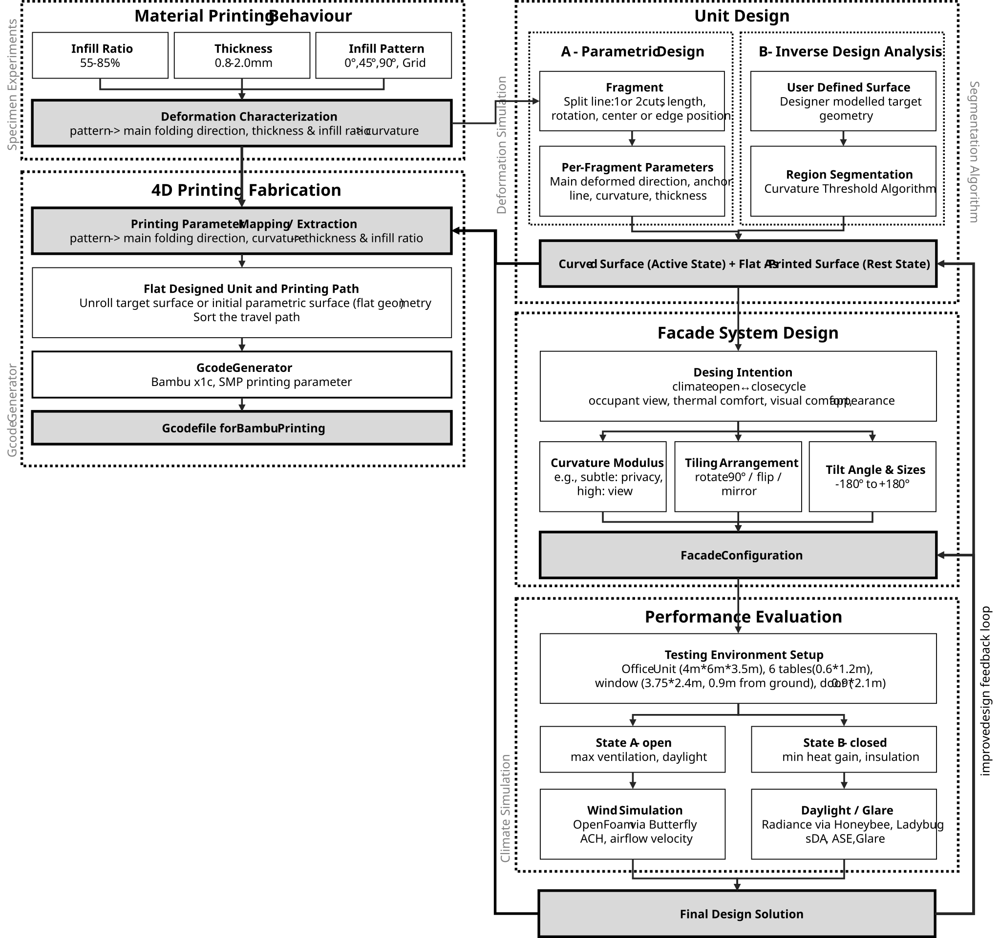

# 4D-Printed Shape Memory Polymer for Responsive Facade

<p align="center">

</p>

This repository contains the parametric Grasshopper definition and Rhino model developed for the MSc thesis:

**"4D-Printed Shape Memory Polymers for Responsive Facades"**
Jiang Yu-Ai (Ellen) — TU Delft, 2026 <br>
Supervisors: Dr. Serdar Așut (Digital Technologies), Ir. Eric van den Ham (Environmental & Climate Design)

The tool links **experimental-based SMP material behavior** (infill ratio, thickness, infill pattern) to **parametric façade geometry generation**, **fabrication-ready G-code output**, and **environmental performance simulation** (CFD ventilation + Radiance daylighting) within a single Grasshopper workflow.

📄 Full methodology, experiments, and results are documented in the accompanying thesis PDF in TU Delft Repository. <br>
🔗 Link:...

## Repository Contents

| File | Description |
|---|---|
| `4DP_SMP_Rhino.3dm` | Rhino model file. Contains reference geometry, baseline curves/surfaces, and the test office room used for CFD/Radiance simulation (Section 5.1). |
| `4DP_SMP_GHfile.gh` | Main Grasshopper definition. Contains all 5 modules described below (Material Behavior, Unit Design, Façade System, Performance Evaluation, Fabrication). |

---

## 1. Requirements

### 1.1 Software

| Software | Version | Notes |
|---|---|---|
| **Rhino** | Rhino 8 | Required. Grasshopper is bundled with Rhino 8 (no separate install needed). |
| **Grasshopper** | Built into Rhino 8 | — |

### 1.2 Grasshopper Plugins

Install the following Ladybug Plugins. Ladybug Tools (Ladybug + Honeybee + Butterfly) are normally installed together as a suite. See [https://www.ladybug.tools](https://www.ladybug.tools) for the official installer and version compatibility notes.


### 1.3 Optional (for fabrication / G-code preview only)

| Software | Purpose |
|---|---|
| **Bambu Studio** | Used only to preview/verify the exported G-code (travel path, print quality) before sending it to a Bambu printer. Not required to run the Grasshopper file itself. G-code is generated directly from Module 05 without external slicing software. |

---

## 2. Opening the File

1. Open `4DP_SMP_Rhino.3dm` in Rhino 8 first (this loads the reference geometry/units that the GH file expects).
2. From within that Rhino session, open `4DP_SMP_GHfile.gh` in Grasshopper (`File > Open`, or drag-and-drop into the Grasshopper canvas).
3. Grasshopper components referencing Rhino geometry (curves, surfaces, the test room volume) will automatically re-link to the geometry in the open `.3dm` file. If any component shows a red error icon, right-click it → confirm it is still referencing the correct Rhino layer/object.

---

## 3. Workflow Structure (Module Overview)

The Grasshopper file is organized into 5 modules, matching the CAD tool framework in the thesis (Section 4.3, Figure 42):

```
01 — Material Printing Behavior   →  Material lookup table (infill ratio, thickness, pattern → curvature)
02 — Unit Design                  →  Pathway A (parametric) + Pathway B (inverse/freeform analysis)
03 — Façade System Design         →  Tiling, panel size, louver tilt angle aggregation
04 — Performance Evaluation       →  Butterfly (CFD) + Honeybee/Ladybug (daylight, glare)
05 — Fabrication                  →  Toolpath planning + G-code generator

```
<p align="center">

</p>

---

## 4. Quick Start

1. Open both files.
2. In Module 01, set a target curvature value to see the recommended fabrication parameters.
3. In Module 02 (Pathway A), toggle the polygon cut pattern / fold axis sliders to preview the as-printed vs. activated shape live in the Rhino viewport.
4. In Module 03, array the unit across a façade grid and adjust tiling/tilt sliders.
5. In Module 04, evaluate ventilation and daylighting for your configuration.
6. In Module 05, bake/export the G-code output to a `.gcode` file and preview it in Bambu Studio if desired.

---

## Citation

If you use or build on this tool, please cite:
> Jiang, Y.A. (2026). *4D-Printed Shape Memory Polymers for Responsive Facades* [Master's thesis]. TU Delft.

